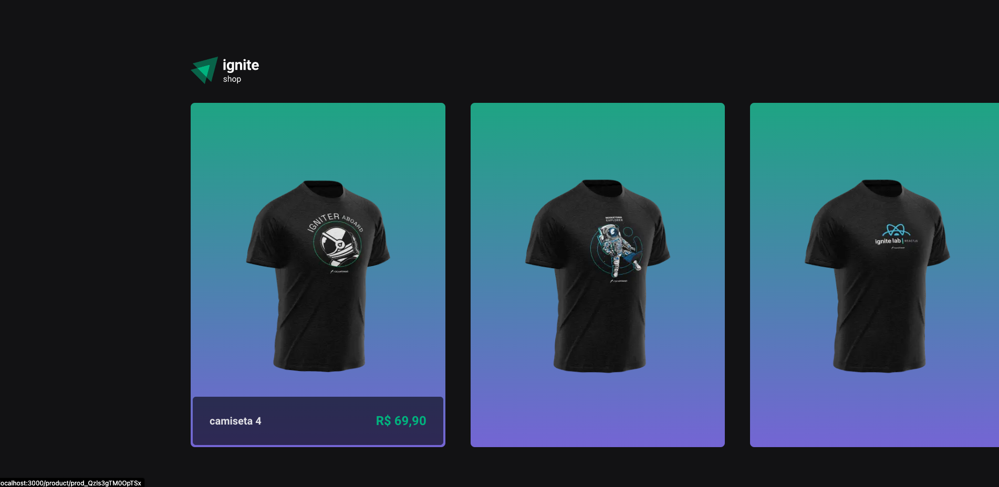
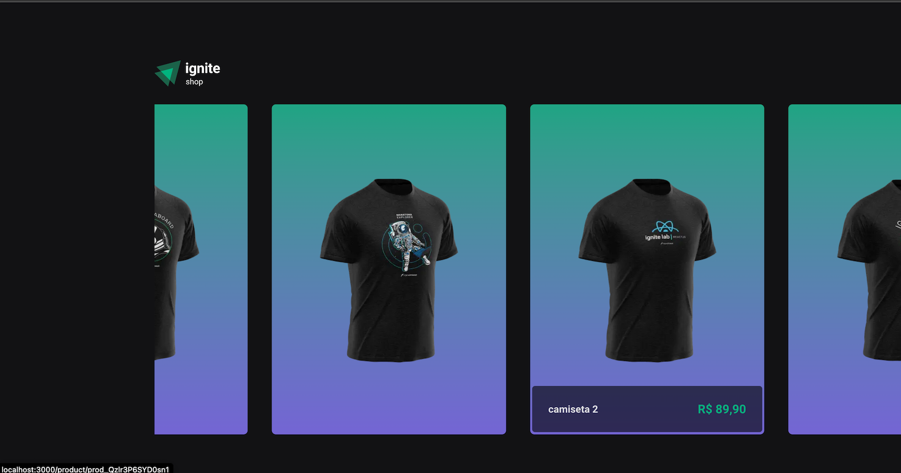
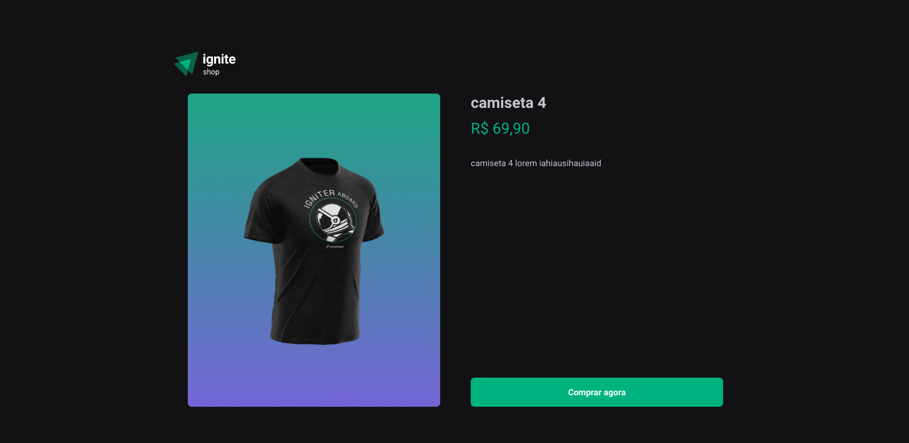
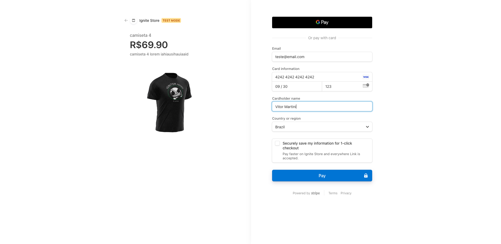
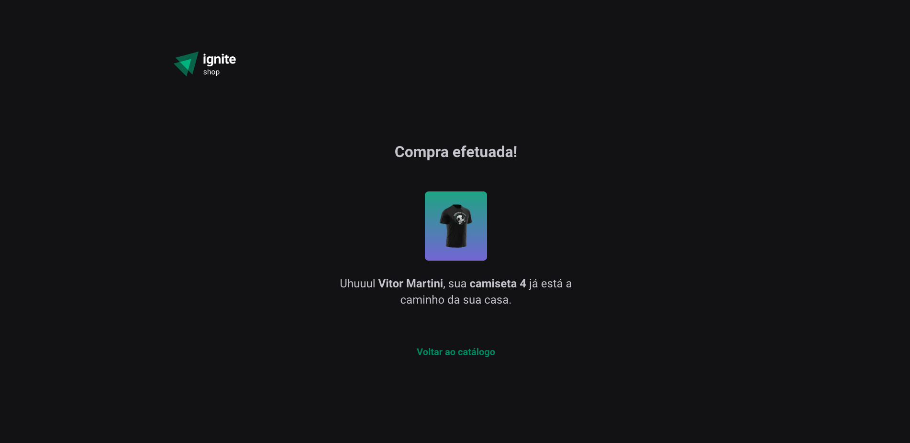

# Ignite Shop - E-commerce Application 
This project is a simple e-commerce platform developed using **Next.js**  with a test/development integration with **Stripe** . It is part of the Rocketseat Ignite course. The objective of this project was to explore Next.js with a focus on the different types of rendering approaches in Next.js: **CSR (Client-Side Rendering)** , **SSR (Server-Side Rendering)** , and **SSG (Static Site Generation)** .
## Objective 

The main goal of this project was to build a basic e-commerce application that simulates an online shopping experience with products and a checkout process integrated with Stripe (for testing purposes only). The project was designed to deepen the understanding of how Next.js handles different rendering strategies and improve the overall developer experience with these tools.

## Technologies Used 
 
- **Next.js** 
- **React** 
- **TypeScript**
- **Stripe API** :  A basic integration with Stripe to simulate the checkout process. This is strictly for test and development purposes.

## Print Screens 

